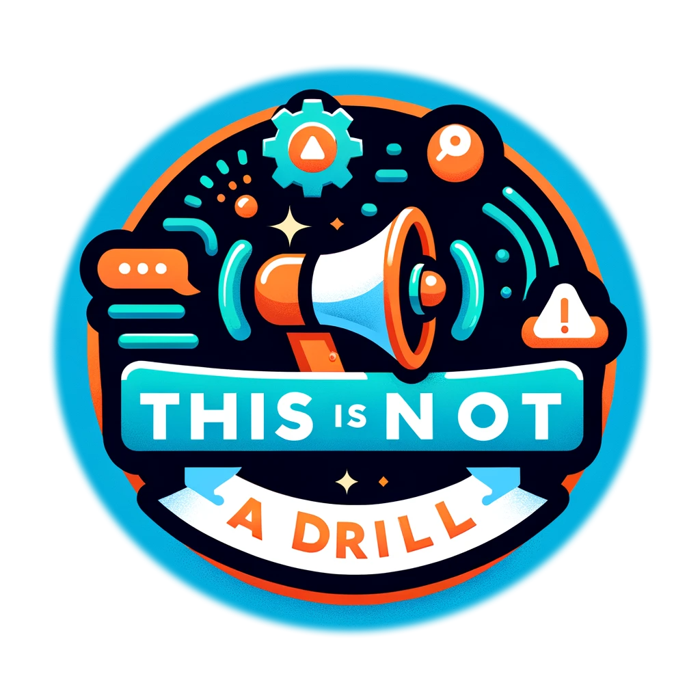

# This Is Not A Drill!

## This is Not A Drill! (TINAD) -- Main Codebase

**This is Not A Drill!** is a service with which you can popup
important service messages to grab your users' in-app attention,
_without code deploys_.

Common use cases are :

* website outages / problems
* scheduled maintenance
* important updates to your user flow
* changes to your service offerings
* legal changes/updates, e.g. regarding privacy policy, SLA, or TOS

TINAD gives you fine-grained control over where, when, and who sees
important messages (right down to their locale, if you use
ipgeolocation), and everything can be set up and controlled via
TINAD's dashboard.

TINAD takes care of tracking views for you, so your users are never
stuck seeing an alert they've already seen. In TINAD's dashboard, you
can review who's seen what and when...

With TINAD you'll never be at a loss when your CTO says

> _Hey Mac! Did you inform all our users there's a problem with the checkout step?_

TINAD is designed by an engineer, with engineering teams in mind. It's
easy to integrate into your app with a one-liner. And it's cost
effective. Sure, you could maybe build something like this yourself,
but who's got the time?  In 5 minutes you'll be up and running with
TINAD, which is built to scale, on the world's web best technologies.

In this repo you'll find TINAD's API, the dashboard, and the client
SDK that is published to npm.  You can always sign up for free to try
the service out in our sandbox, at https://this-is-not-a-drill.com.

